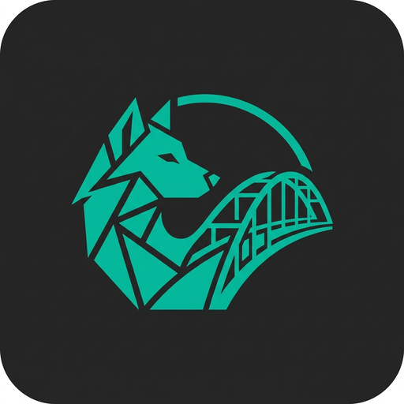

  
  <h1>LupoBridge</h1>
  
<b>The ultimate Local-First Clipboard & File Synchronization tool.</b>

  
  

---

## 🇬🇧 English

**LupoBridge** is a powerful, cross-platform application that seamlessly bridges your devices. Copy text on your phone and paste it on your PC instantly. Send heavy files across the room at the speed of your local WiFi. No clouds, no accounts, 100% private.

### ✨ Key Features
- **Instant Clipboard Sync**: Copy on Android, paste on Windows, Mac, or Linux instantly.
- **Blazing Fast File Transfer**: Send photos, videos, and large files directly over your local network without compression.
- **100% Privacy-Focused**: No intermediate servers. Your data never leaves your local network (LAN/WiFi).
- **Favorites Management**: Star your most-used clips (passwords, addresses, links) so you never lose them.
- **Native Android TV Support**: Push APKs or movies directly from your PC/phone to your TV.
- **Secure QR Pairing**: Connect devices instantly without creating accounts or entering passwords.

### 🚀 Download
You can download the latest version for your platform from the [Releases page](../../releases).
- Available for: **Windows, macOS, Linux, Android & Android TV**.

### 🔒 Privacy by Design
LupoBridge uses direct P2P connections via TCP. We do not collect, store, or sell your data. Everything happens locally between your paired devices.

---

 

## 🇪🇸 Español

**LupoBridge** es una potente aplicación multiplataforma que conecta tus dispositivos sin fricción. Copia texto en tu móvil y pégalo en tu PC al instante. Envía archivos pesados a la velocidad máxima de tu WiFi local. Sin nubes, sin cuentas, 100% privado.

### ✨ Características Principales
- **Sincronización de Portapapeles Inmediata**: Copia en Android, pega en Windows, Mac o Linux al momento.
- **Transferencia de Archivos a Vértigo**: Envía fotos, vídeos y archivos pesados directamente por tu red local sin compresión.
- **100% Enfocado en la Privacidad**: Sin servidores intermedios. Tus datos nunca salen de tu red (LAN/WiFi).
- **Gestión de Favoritos**: Marca tus clips más usados (contraseñas, direcciones, enlaces) para tenerlos siempre a mano.
- **Soporte Nativo para Android TV**: Envía APKs o películas directamente desde tu PC/móvil a tu televisor.
- **Emparejamiento Seguro por QR**: Conecta dispositivos instantáneamente sin crear cuentas ni meter contraseñas.

### 🚀 Descargas
Puedes descargar la última versión para tu sistema desde la [página de Releases](../../releases).
- Disponible para: **Windows, macOS, Linux, Android y Android TV**.

### 🔒 Privacidad por Diseño
LupoBridge utiliza conexiones directas P2P mediante TCP. No recopilamos, almacenamos ni vendemos tus datos. Todo ocurre de forma local entre los dispositivos que tú emparejes.
